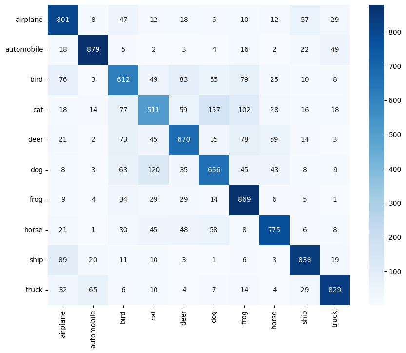
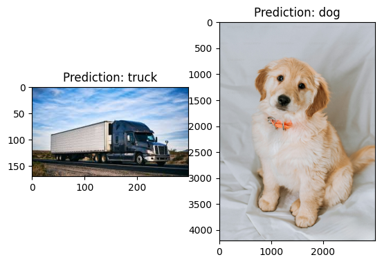

# CIFAR-10 Image Classification with CNN

This project is an implementation of image classification using Convolutional Neural Networks (CNN) on the CIFAR-10 dataset. The goal is to classify images into one of the 10 predefined categories.

### Table of Contents

1. [Overview](#overview)
2. [Installation](#installation)
3. [Usage](#usage)
4. [Model Architecture](#model-architecture)
5. [Results](#results)
6. [License](#license)

### Overview

In this project, we used a CNN to classify images from the CIFAR-10 dataset. The CIFAR-10 dataset contains 60,000 32x32 color images in 10 classes, with 6,000 images per class. The classes include airplane, automobile, bird, cat, deer, dog, frog, horse, ship, and truck.

The model architecture includes multiple convolutional layers with ReLU activations, max pooling layers, and dropout for regularization.

### Installation

To run this project, you will need to have Python installed with the following libraries:

- TensorFlow
- Keras
- Matplotlib
- Seaborn
- NumPy
- pandas

You can install the required libraries using `pip`:

```bash
pip install tensorflow keras matplotlib seaborn numpy pandas
```

### Usage

1. Clone this repository:

    ```bash
    git clone https://github.com/yourusername/cifar-10-cnn.git
    cd cifar-10-cnn
    ```

2. Run the `cifarprediction.ipynb` notebook in a Jupyter environment.

    ```bash
    jupyter notebook cifarprediction.ipynb
    ```

### Model Architecture

The model is a Convolutional Neural Network (CNN) with the following layers:

- Conv2D layer with 32 filters and ReLU activation
- MaxPooling2D layer for downsampling
- Dropout for regularization
- Additional Conv2D and MaxPooling2D layers
- Flatten layer to reshape the data
- Dense layer with 64 units
- Final Dense layer with 10 units (for 10 classes) and softmax activation

Here is the model summary:

```python
model.summary()
```

### Results

The model was trained for 60 epochs with a batch size of 16. The accuracy and loss plots show the model’s performance over time. Below are the results after training:

- **Accuracy**: The model achieved X% accuracy on the test set.
- **Loss**: The model's loss decreased significantly during training.

Example confusion matrix for model evaluation:



### Example Predictions




### License

This project is licensed under the MIT License.

---
